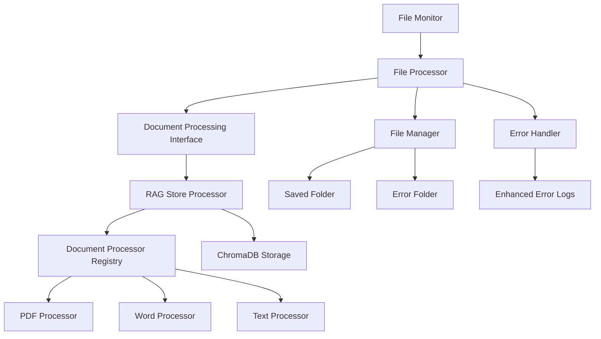

# Design Document

## Overview

This design integrates the existing RAG store functionality with the folder file processor application through a modular, pluggable document processing architecture. The integration replaces the current basic file processing logic with a sophisticated document processing pipeline that converts files into embeddings and stores them in ChromaDB for semantic search capabilities.

The design maintains the existing application structure while introducing a new abstraction layer for document processing that allows for future extensibility to other processing systems beyond RAG.

## Architecture

### High-Level Architecture



### Component Integration Flow

1. **File Detection**: File Monitor detects new files in source folder
2. **Processing Dispatch**: File Processor receives file and dispatches to Document Processing Interface
3. **Document Processing**: RAG Store Processor determines file type and processes through appropriate processor
4. **Embedding Storage**: Successful processing stores embeddings in ChromaDB
5. **File Movement**: Processed files move to saved folder; failed files move to error folder
6. **Error Handling**: Enhanced error logs capture RAG-specific processing failures

## Components and Interfaces

### Document Processing Interface

**Purpose**: Abstract interface for pluggable document processing systems

```python
from abc import ABC, abstractmethod
from pathlib import Path
from typing import Dict, Any, Optional

class DocumentProcessingInterface(ABC):
    """Abstract interface for document processing systems."""
    
    @abstractmethod
    def initialize(self, config: Dict[str, Any]) -> bool:
        """Initialize the document processing system."""
        pass
    
    @abstractmethod
    def is_supported_file(self, file_path: Path) -> bool:
        """Check if file type is supported."""
        pass
    
    @abstractmethod
    def process_document(self, file_path: Path) -> ProcessingResult:
        """Process a document and return result."""
        pass
    
    @abstractmethod
    def get_supported_extensions(self) -> set[str]:
        """Get supported file extensions."""
        pass
    
    @abstractmethod
    def cleanup(self) -> None:
        """Cleanup resources."""
        pass
```

### RAG Store Processor

**Purpose**: Concrete implementation of DocumentProcessingInterface using the existing RAG store

```python
class RAGStoreProcessor(DocumentProcessingInterface):
    """RAG Store implementation of document processing."""
    
    def __init__(self):
        self.registry: Optional[ProcessorRegistry] = None
        self.model_vendor: ModelVendor = ModelVendor.GOOGLE
        self.initialized: bool = False
    
    def initialize(self, config: Dict[str, Any]) -> bool:
        """Initialize RAG store components."""
        # Load environment variables
        # Initialize processor registry
        # Validate ChromaDB connectivity
        # Setup embedding models
        pass
    
    def process_document(self, file_path: Path) -> ProcessingResult:
        """Process document through RAG store pipeline."""
        # Use existing store_embeddings.py logic
        # Process through document processor registry
        # Store embeddings in ChromaDB
        # Return processing result
        pass
```

### Enhanced File Processor

**Purpose**: Modified FileProcessor that integrates with document processing interface

**Key Changes**:
- Replace `_perform_processing()` method to use DocumentProcessingInterface
- Add document processor initialization during FileProcessor construction
- Enhance error handling for document processing failures
- Maintain existing retry logic and file movement behavior

### Configuration Management

**Purpose**: Extend existing ConfigManager to handle document processing configuration

**New Configuration Options**:
```python
@dataclass
class DocumentProcessingConfig:
    """Configuration for document processing."""
    processor_type: str = "rag_store"  # Type of processor to use
    google_api_key: Optional[str] = None
    openai_api_key: Optional[str] = None
    chroma_db_path: Optional[str] = None
    model_vendor: str = "google"
    enable_processing: bool = True
```

## Data Models

### ProcessingResult

**Purpose**: Standardized result object for document processing operations

```python
@dataclass
class ProcessingResult:
    """Result of document processing operation."""
    success: bool
    file_path: str
    processor_used: Optional[str] = None
    chunks_created: int = 0
    processing_time: float = 0.0
    error_message: Optional[str] = None
    error_type: Optional[str] = None
    metadata: Dict[str, Any] = None
    
    def __post_init__(self):
        if self.metadata is None:
            self.metadata = {}
```

### Enhanced Error Information

**Purpose**: Extended error logging for document processing failures

```python
@dataclass
class DocumentProcessingError:
    """Enhanced error information for document processing."""
    file_path: str
    processor_type: str
    error_message: str
    error_type: str
    stack_trace: Optional[str] = None
    file_metadata: Dict[str, Any] = None
    processing_context: Dict[str, Any] = None
```

## Error Handling

### Error Classification

1. **Configuration Errors**: Missing API keys, invalid ChromaDB path
2. **Initialization Errors**: Failed to load processors, ChromaDB connection issues
3. **Processing Errors**: File format issues, embedding generation failures
4. **Storage Errors**: ChromaDB write failures, disk space issues

### Error Handling Strategy

1. **Initialization Failures**: Log error and terminate application (per requirements)
2. **File Processing Failures**: Move file to error folder with enhanced error log
3. **Transient Errors**: Apply existing retry logic with exponential backoff
4. **Permanent Errors**: Immediate failure without retry

### Enhanced Error Logs

**Format**: `[filename].[extension].log`

**Content Structure**:
```
Timestamp: 2025-01-23 10:30:45
File: /source/project1/document.pdf
Processor: RAGStoreProcessor
Document Type: PDF
Error Type: embedding_generation_failure
Error: Failed to generate embeddings: API rate limit exceeded
Processing Context:
  - File Size: 2.5 MB
  - Chunks Attempted: 45
  - Model Used: text-embedding-004
  - ChromaDB Collection: documents_google
Stack Trace: [if applicable]
```

## Testing Strategy

### Unit Tests Structure

```
tests/
├── test_rag_integration/
│   ├── __init__.py
│   ├── test_document_processing_interface.py
│   ├── test_rag_store_processor.py
│   ├── test_enhanced_file_processor.py
│   ├── test_configuration_management.py
│   └── test_error_handling.py
└── test_rag_store/  # Existing tests
    └── [existing test files]
```

### Test Categories

1. **Interface Compliance Tests**: Verify RAGStoreProcessor implements DocumentProcessingInterface correctly
2. **Integration Tests**: Test end-to-end file processing with RAG store
3. **Error Handling Tests**: Test various failure scenarios and error logging
4. **Configuration Tests**: Test configuration loading and validation
5. **Performance Tests**: Test processing performance with various file sizes

### Mock Strategy

- Mock ChromaDB for unit tests to avoid external dependencies
- Mock embedding API calls to avoid API costs during testing
- Use test fixtures for various file types and sizes
- Mock file system operations for error simulation

## Implementation Phases

### Phase 1: Core Interface and RAG Integration
1. Create DocumentProcessingInterface abstract class
2. Implement RAGStoreProcessor using existing RAG store code
3. Modify FileProcessor to use DocumentProcessingInterface
4. Update configuration management for document processing settings

### Phase 2: Enhanced Error Handling
1. Implement enhanced error logging with document processing context
2. Update ErrorHandler to create detailed error logs
3. Add error classification for document processing failures
4. Implement proper error handling for initialization failures

### Phase 3: Configuration and Initialization
1. Extend ConfigManager with document processing configuration
2. Update application initialization to setup document processing
3. Add validation for required environment variables
4. Implement graceful degradation for missing dependencies

### Phase 4: Testing and Documentation
1. Create comprehensive unit tests for all new components
2. Update integration tests to cover document processing workflow
3. Update README with new configuration options and workflow
4. Add troubleshooting guide for document processing issues

## Performance Considerations

### Memory Management
- Process files individually to avoid memory buildup
- Use streaming for large files where possible
- Implement proper cleanup of temporary resources

### Processing Optimization
- Leverage existing RAG store optimizations (chunking parameters)
- Implement file size limits to prevent excessive processing times
- Add timeout handling for long-running processing operations

### Storage Efficiency
- Use existing ChromaDB collections and indexing
- Implement deduplication to avoid processing same content multiple times
- Monitor disk space usage for ChromaDB storage

## Security Considerations

### API Key Management
- Secure storage of embedding API keys in environment variables
- Validation of API key format and permissions
- Proper error handling without exposing sensitive information

### File Access Security
- Validate file paths to prevent directory traversal
- Implement proper file permission checks
- Sanitize file content before processing

### Data Privacy
- Ensure document content is not logged in plain text
- Implement proper cleanup of temporary processing files
- Consider encryption for sensitive document storage

## Monitoring and Observability

### Structured Logging
- Leverage existing RAG store structured logging
- Add document processing metrics to application logs
- Include processing performance metrics

### Health Checks
- Extend existing health checks to include document processing system
- Monitor ChromaDB connectivity and performance
- Track embedding API usage and rate limits

### Metrics Collection
- Document processing success/failure rates
- Processing time distributions by file type
- ChromaDB storage usage and growth
- API usage and cost tracking